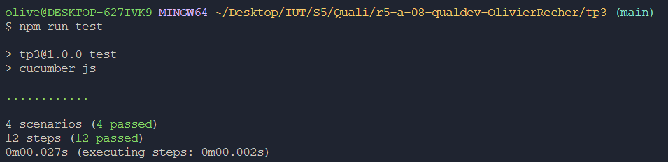

= R5.A.08 -- Dépôt pour les TPs
:icons: font
:MoSCoW: https://fr.wikipedia.org/wiki/M%C3%A9thode_MoSCoW[MoSCoW]

Ce dépôt concerne les rendus de mailto:A_changer@etu.univ-tlse2.fr[Jonh Doe].

== TP1

is_it_friday_yet.feature

----
Feature: Is it friday yes

  Scenario Outline: Check if it's Friday on a Sunday
    Given today is "<day>"
    When I ask whether it's Friday yet
    Then the answer should be "<answer>"

    Examples:
    | day            | answer |
    | Friday         | TGIF   |
    | Sunday         | Nope   |
    | anything else! | Nope   |

----

Screen résultat du test

== TP2

Order.java

----
package dojo;

import java.util.List;

public class Order {
    private String owner;
    private String target;
    private List<String> cocktails;

    public void declareOwner(String owner) {
        this.owner = owner;
    }

    public void declareTarget(String target) {
        this.target = target;
    }

    public List<String> getCocktails() {
        return cocktails;
    }
}
----

Screen résultat du test

== TP3

test.feature

----
Feature: Homework Management

  Scenario Outline: Add a New Homework
    Given I am student
    When I add a new homework with the title "<title>"
    Then the homework is "<result>" 

    Examples:
    | title                             | result |
    | Mathematics Homework            | created   |
    | SAE                             | created   |
    

  Scenario Outline: Work on the Homework
    Given that the homework "<title>" exists
    When I work on the homework 
    Then the homework is now "<result>" 

    Examples:
    | title                             | result |
    | Mathematics Homework            | done   |
    | SAE                             | done   |
----

testSteps.js

----
const { Given, When, Then } = require('@cucumber/cucumber');
const assert = require('assert');

let student;
let homeworks = [];
let exist;
let result1;
let result2;

Given('I am student', function () {
    student = "student";
});

When('I add a new homework with the title {string}', function (title) {
    homeworks.push(title);
    result1 = "created";
});

Then('the homework is {string}', function (expectedResult) {
    assert(result1, expectedResult);
});

Given('that the homework {string} exists', function (title) {
    exist = homeworks.includes(title);
});

When('I work on the homework', function () {
    if (exist) {
        result2 = "done";
    }
});

Then('the homework is now {string}', function (expectedResult) {
    assert(result2, expectedResult);
});
----

L'objectif était ici de tester que lorsque j'avais des devoirs à rendre, je les ajoutais bien à ma liste de devoirs à faire et je vérifiais qu'ils avaient bien été faits.

Screen résultat du test

